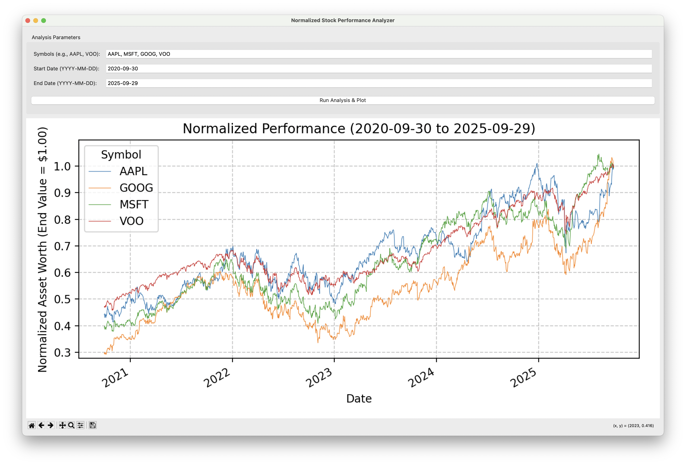

# Normalized Stock Performance Analyzer 📈

A Python desktop application built with **Tkinter** for the GUI and **Matplotlib** for interactive plotting, which analyzes and visualizes the normalized performance of multiple stock symbols over a specified time period using data from Yahoo Finance.

## 🖼 Application Screenshot



## ✨ Features

* **Normalized Analysis:** Calculates the total return series for multiple assets, scaling the performance such that the **final value of all assets is \$1.00**. This makes it easy to compare how much initial capital was required for each asset to reach the same end-point value.
* **Interactive Plotting:** Displays the results using Matplotlib, embedded via `FigureCanvasTkAgg` and includes the full interactive **Matplotlib Toolbar** (pan, zoom, reset, save).
* **User-Friendly GUI:** Simple Tkinter interface for inputting stock symbols (e.g., `AAPL, VOO`), start date, and end date.
* **Data Source:** Uses the popular `yfinance` library for reliable, adjusted historical stock data.

## 💡 How the Normalization Works

This application uses a unique approach to normalize the data:

Instead of normalizing all series to start at \$1.00 (which is the standard way to compare returns), this application normalizes all series to **end at \$1.00**.

$$
\text{Normalized Price}_t = \frac{\text{Adjusted Price}_t}{\text{Adjusted Price}_{\text{End}}}
$$

This means:

1.  The value on the last date of the plot is always **1.00** for every asset.
2.  The value on the **first date** of the plot represents the **initial investment required** to have an asset worth \$1.00 at the end date. A lower starting value means the asset delivered a higher return during the period.

## 🚀 Getting Started

### Prerequisites

You need **Python 3.6+** installed.

### Installation

Clone the repository and install the required Python libraries:

```bash
git clone https://github.com/Wang-Yue/Normalized-Stock-Performance-Analyzer
cd Normalized-Stock-Performance-Analyzer
pip install -r requirements.txt
